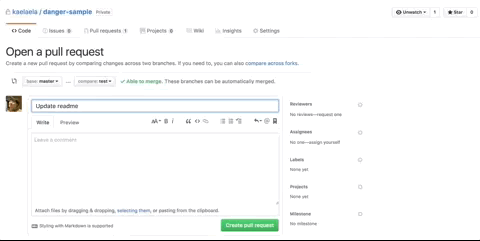

A [Danger](http://danger.systems/ruby/) plugin. ([RubyGems](https://rubygems.org/gems/danger-auto_label))

### danger-auto_label

No more set label to issue or pull request manually.  
Example, you can set labels simply by changing the PR title.



### Usage

Very simple usage.  

First, install gem.

```
$ gem install danger-auto_label
```

Set wip label automatically when the PR title contains '[WIP]'.

```sample.rb
  if github.pr_title.include? "[WIP]"
    auto_label.wip=(github.pr_json["number"])
  else
    auto_label.remove("WIP")
    # If you want to delete label
    # auto_label.delete("WIP")
  end
```

#### Methods

`wip=` - Set WIP label to PR.

```ruby
# Add "WIP" label to this Pull Request
pr_number = github.pr_json["number"]
auto_label.wip=(pr_number) 
```

`set` - Set any labels to PR by this.

```ruby
# Add "Orange Label" with orange color to this Pull Request
# Note: will create label if it does not exist
pr_number = github.pr_json["number"]
auto_label.set(pr_number, "Orange Label", "ff8800") 
```

`delete` - Delete any labels from repository.

```ruby
# Remove "Orange Label" from this Repository (use with caution!)
auto_label.delete("Orange Label") 
```

`remove` - Remove any labels from PR.

```ruby
# Remove "Orange Label" from this Pull Request
auto_label.remove("Orange Label") 
```
